# Crystal Lang Learning

Ruby is the shell, Go is the kernel, but LLVM.

## Resources

- [RFC](https://github.com/crystal-lang/rfcs)
- https://www.slideshare.net/crystallanguage/crystal-internals-part-1-70673255
- https://www.slideshare.net/crystallanguage/crystal-presentation-at-recurse-center-ny

## Enumerable/Iterable

## IO

```mermaid
classDiagram

class IO {
  << abstract class >>
}
link IO "https://crystal-lang.org/api/master/IO.html"

class IO_Buffered["IO::Buffered"] {
  << module >>
}
link IO_Buffered "https://crystal-lang.org/api/master/IO/Buffered.html"

class IO_Memory["IO::Memory"] {
  << class >>
}
link IO_Memory "https://crystal-lang.org/api/master/IO/Memory.html"

class String_Builder["String::Builder"] {
  << class >>
}

link String_Builder "https://crystal-lang.org/api/master/String/Builder.html"

class IO_Hexdump["IO::Hexdump"] {
  << class >>
}
link IO_Hexdump "https://crystal-lang.org/api/master/IO/Hexdump.html"

class IO_Sized["IO::Sized"] {
  << class >>
}
link IO_Sized "https://crystal-lang.org/api/master/IO/Sized.html"

class IO_Delimited["IO::Delimited"] {
  << class >>
}
link IO_Delimited "https://crystal-lang.org/api/master/IO/Delimited.html"

class IO_Stapled["IO::Stapled"] {
  << class >>
}
link IO_Stapled "https://crystal-lang.org/api/master/IO/Stapled.html"

class IO_MultiWriter["IO::MultiWriter"] {
  << class >>
}
link IO_MultiWriter "https://crystal-lang.org/api/master/IO/MultiWriter.html"

class IO_Digest["IO::Digest"] {
  << class >>
}
link IO_Digest "https://crystal-lang.org/api/master/IO/Digest.html"

class Compress_Deflate_Reader["Compress::Deflate::Reader"] {
  << class >>
}
link Compress_Deflate_Reader "https://crystal-lang.org/api/master/Compress/Deflate/Reader.html"

class Compress_Deflate_Writer["Compress::Deflate::Writer"] {
  << class >>
}
link Compress_Deflate_Writer "https://crystal-lang.org/api/master/Compress/Deflate/Writer.html"

class Compress_Gzip_Reader["Compress::Gzip::Reader"] {
  << class >>
}
link Compress_Gzip_Reader "https://crystal-lang.org/api/master/Compress/Gzip/Reader.html"

class Compress_Gzip_Writer["Compress::Gzip::Writer"] {
  << class >>
}
link Compress_Gzip_Writer "https://crystal-lang.org/api/master/Compress/Gzip/Writer.html"

class Compress_Zlib_Reader["Compress::Zlib::Reader"] {
  << class >>
}
link Compress_Gzip_Reader "https://crystal-lang.org/api/master/Compress/Zlib/Reader.html"

class Compress_Zlib_Writer["Compress::Zlib::Writer"] {
  << class >>
}
link Compress_Gzip_Writer "https://crystal-lang.org/api/master/Compress/Zlib/Writer.html"

class IO_FileDescriptor["IO::FileDescriptor"] {
  << class >>
}
link IO_FileDescriptor "https://crystal-lang.org/api/master/IO/FileDescriptor.html"

class File {
  << class >>
}
link File "https://crystal-lang.org/api/master/File.html"


IO <|-- IO_Memory : extends
IO <|-- String_Builder : extends
IO <|-- IO_Hexdump : extends
IO <|-- IO_Sized : extends
IO <|-- IO_Delimited : extends
IO <|-- IO_Stapled : extends
IO <|-- IO_MultiWriter : extends
IO <|-- IO_Digest : extends
IO <|-- Compress_Deflate_Reader : extends
IO <|-- Compress_Deflate_Writer : extends
IO <|-- Compress_Gzip_Reader : extends
IO <|-- Compress_Gzip_Writer : extends
IO <|-- Compress_Zlib_Reader : extends
IO <|-- Compress_Zlib_Writer : extends
IO <|-- IO_FileDescriptor : extends

IO_Buffered <|-- Compress_Deflate_Reader : include
IO_Buffered <|-- Compress_Deflate_Writer : include
IO_Buffered <|-- Compress_Gzip_Reader : include
IO_Buffered <|-- Compress_Gzip_Writer : include
IO_Buffered <|-- Compress_Zlib_Reader : include
IO_Buffered <|-- Compress_Zlib_Writer : include
IO_Buffered <|-- IO_FileDescriptor : include

IO_FileDescriptor <|-- File : extends
```

### Socket

## Fiber

### Resources

- [Fiber](https://github.com/crystal-lang/crystal/blob/master/src/fiber.cr)
- [Crystal::System::Fiber](https://github.com/crystal-lang/crystal/blob/master/src/crystal/system/fiber.cr)
- [Fiber::Context](https://github.com/crystal-lang/crystal/blob/master/src/fiber/context.cr)
- [Crystal::System::Thread](https://github.com/crystal-lang/crystal/blob/master/src/crystal/system/thread.cr)
- [Crystal::Scheduler](https://github.com/crystal-lang/crystal/blob/master/src/crystal/scheduler.cr)
- [Crystal::System::EventLoop](https://github.com/crystal-lang/crystal/blob/master/src/crystal/system/event_loop.cr)

### Scheduler

### Fiber#enqueue

If the `Fiber` is not bound to a `Thread`, the `Fiber` will be assigned to a `Thread` 

(if `-Dpreview_mt` round-robin else current) and bound to it, finally enqueue it's `Scheduler`.

- Fiber#resume
- Fiber.suspend
- Fiber.yield 
- sleep
- Fiber.timeout

### Workers

worker_count = ENV["CRYSTAL_WORKERS"]? || 4

[worker_count](https://github.com/crystal-lang/crystal/blob/3bf34106ca718c220629d1977e8db72e935dadad/src/crystal/scheduler.cr#L249)

## Summary

- CSP
- Structural Type System
- Union Type
- Global Type Inference
- Tracing GC
- Native Code
- Rich and High Quality Stdlib
