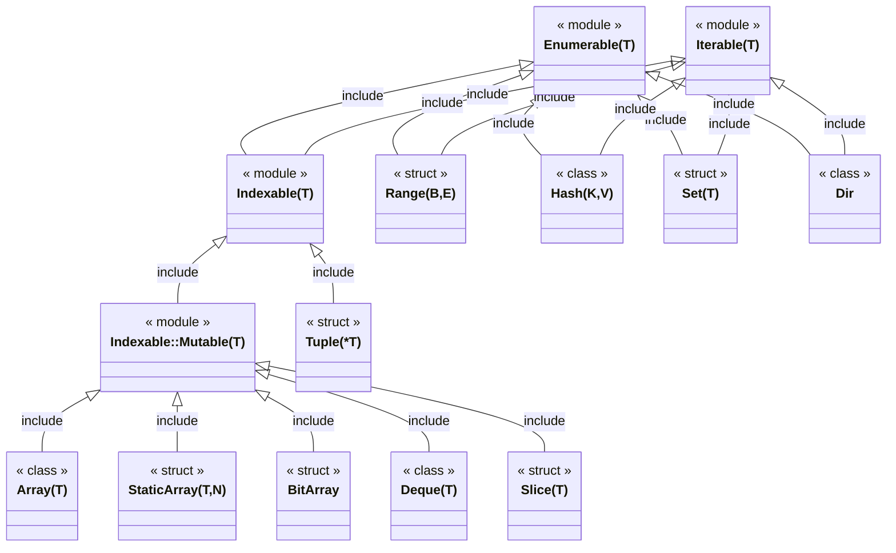
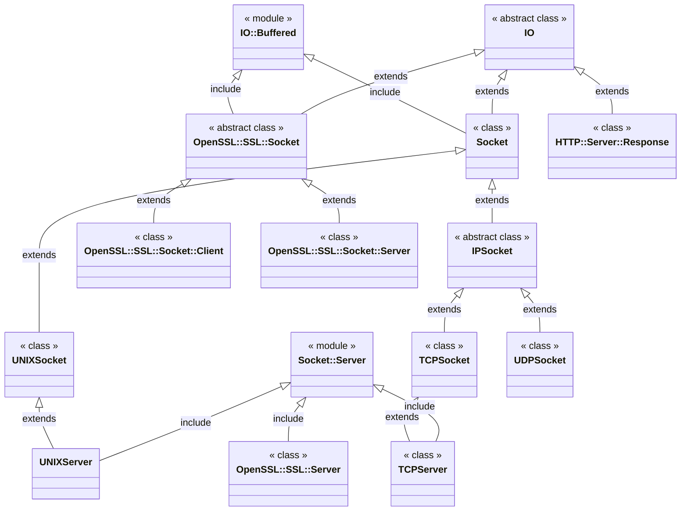
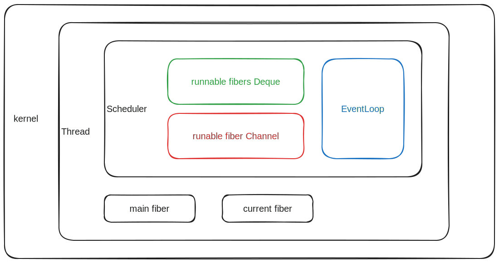

# Crystal Lang Learning

## Resources

- https://www.slideshare.net/crystallanguage/crystal-internals-part-1-70673255
- https://www.slideshare.net/crystallanguage/crystal-presentation-at-recurse-center-ny
- https://lbarasti.com/post/json_beyond_basics
- https://lbarasti.com/post/select_statement
- https://github.com/icyleaf/fast-crystal

## Enumerable/Iterable

## IO

```mermaid
classDiagram

class IO {
  << abstract class >>
}
link IO "https://crystal-lang.org/api/master/IO.html"

class IO_Buffered["IO::Buffered"] {
  << module >>
}
link IO_Buffered "https://crystal-lang.org/api/master/IO/Buffered.html"

class IO_Memory["IO::Memory"] {
  << class >>
}
link IO_Memory "https://crystal-lang.org/api/master/IO/Memory.html"

class String_Builder["String::Builder"] {
  << class >>
}

link String_Builder "https://crystal-lang.org/api/master/String/Builder.html"

class IO_Hexdump["IO::Hexdump"] {
  << class >>
}
link IO_Hexdump "https://crystal-lang.org/api/master/IO/Hexdump.html"

class IO_Sized["IO::Sized"] {
  << class >>
}
link IO_Sized "https://crystal-lang.org/api/master/IO/Sized.html"

class IO_Delimited["IO::Delimited"] {
  << class >>
}
link IO_Delimited "https://crystal-lang.org/api/master/IO/Delimited.html"

class IO_Stapled["IO::Stapled"] {
  << class >>
}
link IO_Stapled "https://crystal-lang.org/api/master/IO/Stapled.html"

class IO_MultiWriter["IO::MultiWriter"] {
  << class >>
}
link IO_MultiWriter "https://crystal-lang.org/api/master/IO/MultiWriter.html"

class IO_Digest["IO::Digest"] {
  << class >>
}
link IO_Digest "https://crystal-lang.org/api/master/IO/Digest.html"

class Compress_Deflate_Reader["Compress::Deflate::Reader"] {
  << class >>
}
link Compress_Deflate_Reader "https://crystal-lang.org/api/master/Compress/Deflate/Reader.html"

class Compress_Deflate_Writer["Compress::Deflate::Writer"] {
  << class >>
}
link Compress_Deflate_Writer "https://crystal-lang.org/api/master/Compress/Deflate/Writer.html"

class Compress_Gzip_Reader["Compress::Gzip::Reader"] {
  << class >>
}
link Compress_Gzip_Reader "https://crystal-lang.org/api/master/Compress/Gzip/Reader.html"

class Compress_Gzip_Writer["Compress::Gzip::Writer"] {
  << class >>
}
link Compress_Gzip_Writer "https://crystal-lang.org/api/master/Compress/Gzip/Writer.html"

class Compress_Zlib_Reader["Compress::Zlib::Reader"] {
  << class >>
}
link Compress_Gzip_Reader "https://crystal-lang.org/api/master/Compress/Zlib/Reader.html"

class Compress_Zlib_Writer["Compress::Zlib::Writer"] {
  << class >>
}
link Compress_Gzip_Writer "https://crystal-lang.org/api/master/Compress/Zlib/Writer.html"

class IO_FileDescriptor["IO::FileDescriptor"] {
  << class >>
}
link IO_FileDescriptor "https://crystal-lang.org/api/master/IO/FileDescriptor.html"

class File {
  << class >>
}
link File "https://crystal-lang.org/api/master/File.html"


IO <|-- IO_Memory : extends
IO <|-- String_Builder : extends
IO <|-- IO_Hexdump : extends
IO <|-- IO_Sized : extends
IO <|-- IO_Delimited : extends
IO <|-- IO_Stapled : extends
IO <|-- IO_MultiWriter : extends
IO <|-- IO_Digest : extends
IO <|-- Compress_Deflate_Reader : extends
IO <|-- Compress_Deflate_Writer : extends
IO <|-- Compress_Gzip_Reader : extends
IO <|-- Compress_Gzip_Writer : extends
IO <|-- Compress_Zlib_Reader : extends
IO <|-- Compress_Zlib_Writer : extends
IO <|-- IO_FileDescriptor : extends

IO_Buffered <|-- Compress_Deflate_Reader : include
IO_Buffered <|-- Compress_Deflate_Writer : include
IO_Buffered <|-- Compress_Gzip_Reader : include
IO_Buffered <|-- Compress_Gzip_Writer : include
IO_Buffered <|-- Compress_Zlib_Reader : include
IO_Buffered <|-- Compress_Zlib_Writer : include
IO_Buffered <|-- IO_FileDescriptor : include

IO_FileDescriptor <|-- File : extends
```

### Socket

## Fiber

### Resources

- [Fiber](https://github.com/crystal-lang/crystal/blob/master/src/fiber.cr)
- [Crystal::System::Fiber](https://github.com/crystal-lang/crystal/blob/master/src/crystal/system/fiber.cr)
- [Fiber::Context](https://github.com/crystal-lang/crystal/blob/master/src/fiber/context.cr)
- [Crystal::System::Thread](https://github.com/crystal-lang/crystal/blob/master/src/crystal/system/thread.cr)
- [Crystal::Scheduler](https://github.com/crystal-lang/crystal/blob/master/src/crystal/scheduler.cr)
- [Crystal::System::EventLoop](https://github.com/crystal-lang/crystal/blob/master/src/crystal/system/event_loop.cr)

### Scheduler

### Fiber#enqueue

If the `Fiber` is not bound to a `Thread`, the `Fiber` will be assigned to a `Thread` 

(if `-Dpreview_mt` round-robin else current) and bound to it, finally enqueue it's `Scheduler`.

| Method        | Source Fiber                              | Target Fiber       |
| ------------- | ----------------------------------------- | ------------------ |
| Fiber#resume  | current suspend forever                   | given by user      | 
| Fiber.suspend | current suspend forever                   | given by scheduler |
| Fiber.yield   | current push into scheduler               | given by scheduler |
| sleep         | current push into scheduler after timeout | given by scheduler |
| Fiber.timeout | current push into scheduler after timeout | given by scheduler |

### Workers

worker_count = ENV["CRYSTAL_WORKERS"]? || 4

[worker_count](https://github.com/crystal-lang/crystal/blob/3bf34106ca718c220629d1977e8db72e935dadad/src/crystal/scheduler.cr#L249)

## Summary

PROS:
- Ruby-like syntax
- [Consistent and easy-to-use API](https://crystal-lang.org/api/master/)  
- Funny [Assignment](https://crystal-lang.org/reference/1.13/syntax_and_semantics/assignment.html#assignment)
- Smart type inference [union type ](https://crystal-lang.org/reference/1.13/syntax_and_semantics/union_types.html) 
- Function: 
    - [ named arg, param default value ](https://crystal-lang.org/reference/1.13/syntax_and_semantics/default_and_named_arguments.html)
    - [param external name](https://crystal-lang.org/reference/1.13/syntax_and_semantics/default_values_named_arguments_splats_tuples_and_overloading.html#external-names)
    - [varargs](https://crystal-lang.org/reference/1.13/syntax_and_semantics/splats_and_tuples.html)
-  Elegant and efficient [inlined block](https://crystal-lang.org/reference/1.13/syntax_and_semantics/blocks_and_procs.html)
- Concise and powerful [operators](https://crystal-lang.org/reference/1.13/syntax_and_semantics/operators.html)
- [ Full OOP (everything is an object) ](https://crystal-lang.org/reference/1.13/syntax_and_semantics/everything_is_an_object.html)
- [ Type: value type, reference type ](https://crystal-lang.org/reference/1.13/syntax_and_semantics/structs.html)
- Polymorphisms: 
    - [ generic ](https://crystal-lang.org/reference/1.13/syntax_and_semantics/generics.html) 
    - [ module ](https://crystal-lang.org/reference/1.13/syntax_and_semantics/modules.html)
    - [class inheritance](https://crystal-lang.org/reference/1.13/syntax_and_semantics/inheritance.html)
- Simple and easy-to-use [ macros ](https://crystal-lang.org/reference/1.13/syntax_and_semantics/macros/index.html) 
    - compile-time type reflection [TypeNode](https://crystal-lang.org/api/master/Crystal/Macros/TypeNode.html)
- Simple and easy-to-use [Pointer](https://crystal-lang.org/api/master/Pointer.html) and [Slice](https://crystal-lang.org/api/master/Slice.html)
- Simple and easy-to-use [ FFI ](https://crystal-lang.org/reference/1.13/syntax_and_semantics/c_bindings/lib.html) and [low_level_primitives](https://crystal-lang.org/reference/1.13/syntax_and_semantics/low_level_primitives.html)
- [Conditonal Compilation](https://crystal-lang.org/reference/1.13/syntax_and_semantics/compile_time_flags.html#user-provided-flags)

CONS:
- Poor compilation speed
- Poor syntax highlight
- Poor LSP server support
- Fiber need more optimizations (memory overhead)
- [ Too many required C-libs used by the compiler and stdlib](https://crystal-lang.org/reference/1.13/man/required_libraries.html)
- Need more optimizations on Windows (binary size, memory overhead)

### Checklist

- Paradigm
    - [ ] Procedural Programming
    - [ ] Functional Programming
    - [x] Object Oriented Programming
- Types
    - [x] Static Type
    - [x] Type auto inference
    - [x] Value Types
    - [x] Reference Types
    - [x] Pointer Types
    - [x] Sum Types
    - [x] Range Type
    - [x] Slice Type
    - [ ] Matrix Type
    - [ ] BitSet Type
    - [ ] BitField Type
    - [x] BitArray Type
    - [x] Record Type
    - [ ] Arbitrary bit-width Integers
    - [ ] Endian Specific Number Type
    - [x] Memory Layout Control
- String
    - [x] Raw String
    - [x] Multiline String
        - [ ] Absolute Indentation 
        - [x] Relative Indentation 
    - [x] String interpolation
    - [x] Null-Terminated String (cstring)
    - [x] Length-Based String
    - [x] Immutable String
    - [ ] Dynamic Length String
- Variables 
    - [ ] Static Local Variables
- Assignment
    - [x] Redefine same name variables
    - [x] Mutate variables
    - [x] Assign by-copy
    - [ ] Assign by-move
    - [ ] Assign by-ref
    - [x] Assign by-auto
    - [x] Multiple values assignment
    - [x] Tuple unpacking
    - [ ] Struct unpacking
    - [ ] Record unpacking
- Functions
    - [ ] UFCS (Uniform Function Call Style)
    - [x] Varargs
    - [x] Named arguments
    - [x] Alias parameters
    - [x] Parameters default value
    - [ ] Multiple return values
    - [ ] Named return values
    - [ ] Partial Application
- Operators
    - [x] Operators Overloading
    - [x] Wrapping Operators
    - [ ] Saturating Operators
    - [ ] Pipe Operator
    - [x] Range Operator
- [x] Control Flow Expressions
- [x] Closures
- Null Handles
    - [x] null/nil value
    - [ ] Optional/Maybe Types
    - [x] Nil Union Types
- Error Handles
    - [x] try-catch throw/raise
    - [ ] Result Type
    - [ ] Multiple return values
- [ ] Pattern Matching
- [x] Generic Types (Parametric Polymorphism)
- [x] SubType Polymorphism
- [ ] Usingnamespace
- [x] Meta Programming
    - [x] Macros
    - [ ] Comptime
- [ ] Custom Memory Allocators
    - [ ] Global
    - [ ] Contextual
- Memory Managements
    - [ ] Manual 
    - [ ] Single Ownership & Destructor
    - [ ] ReferenceCount
    - [x] TracingGC
    - [ ] Depends on Application Platform
- FFI
    - [x] C
    - [ ] C++
    - [ ] Embed C code
    - [ ] Embed C++ code
    - [ ] Embed ASM code
- [ ] Conditional Compilation
- Compilation Backends
    - [ ] C
    - [ ] C++
    - [ ] Javascript
    - [ ] WASM
    - [x] LLVM
    - [ ] JVM
    - [ ] BEAM
- [x] IO Abstraction
- [ ] Without LibSSL or OpenSSL required
- [ ] Multithreading
- [x] Coroutines
    - [x] Stackful
    - [ ] Stackless
    - [ ] Preemptive
